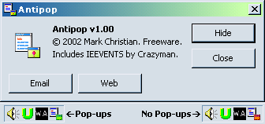



## Antipop \- Functional Pop\-up Stopper

### Description

A pop-up stopper for Internet Explorer. Includes IEEvents by Crazyman. Works great on Windows 2000 -- please tell me about any bugs you encounter on other operating systems.
 
### More Info
 
Doesn't seem to like the Webbrowser control.

             |
---                |---
**Submitted On**   |2002-05-26 01:16:12
**By**             |[Mark Christian](https://github.com/Planet-Source-Code/PSCIndex/blob/master/ByAuthor/mark-christian.md)
**Level**          |Intermediate
**User Rating**    |4.9 (44 globes from 9 users)
**Compatibility**  |VB 6\.0
**Category**       |[Internet/ HTML](https://github.com/Planet-Source-Code/PSCIndex/blob/master/ByCategory/internet-html__1-34.md)
**World**          |[Visual Basic](https://github.com/Planet-Source-Code/PSCIndex/blob/master/ByWorld/visual-basic.md)
**Archive File**   |[Antipop\_\-\_871035262002\.zip](https://github.com/Planet-Source-Code/mark-christian-antipop-functional-pop-up-stopper__1-35096/archive/master.zip)

### API Declarations

Oodles.

